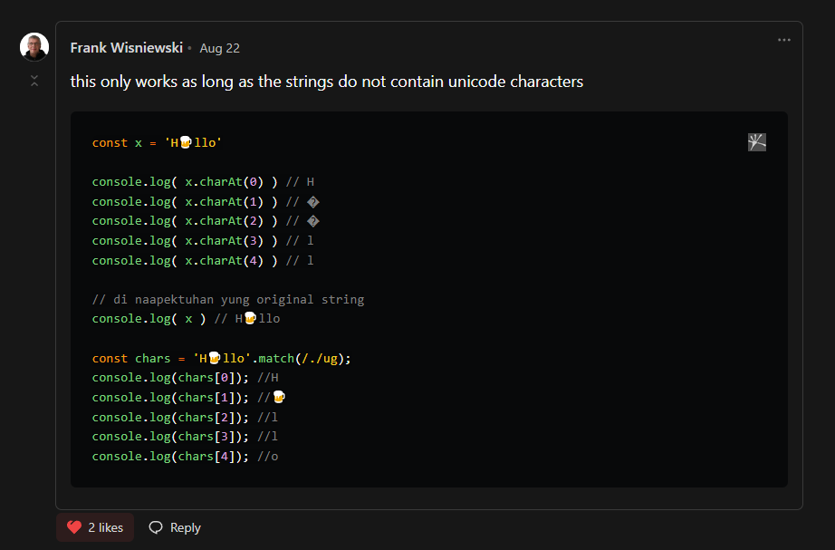

# charAt

## Pagpapaliwanag

bigay mo yung index (number) tapos re return niya yung character na nasa index nayon

> Spaces like '\n' and '\t' included sila

```javascript
const x = 'Hello'

console.log( x.charAt(0) ) // H
console.log( x.charAt(1) ) // e
console.log( x.charAt(2) ) // l
console.log( x.charAt(3) ) // l
console.log( x.charAt(4) ) // o

// di naapektuhan yung original string
console.log( x ) // Hello
```
Notice from: [Frank Wisniewski](https://dev.to/frankwisniewski/comment/2162a)

**Pag may emoji or unicode characters gumamit nalang ng `match` method**
## Iba pang resources

- [MDN Documentation (English)](https://developer.mozilla.org/en-US/docs/Web/JavaScript/Reference/Global_Objects/String/charAt)
